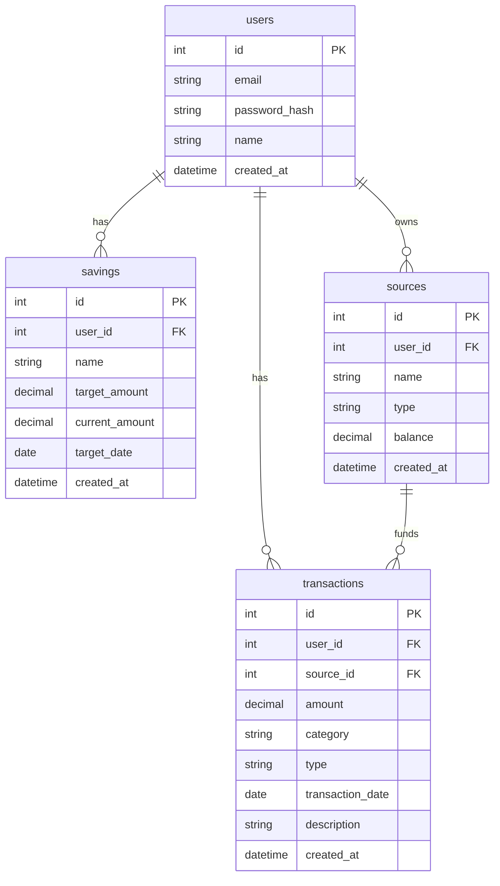

# Finance Tracker App

Finance Tracker is a full-stack personal finance manager built with React + Vite for the frontend and Flask for the backend. The app is designed to track users, transactions, savings goals, and income/source records for managing budgets and spending.

## Entity Relationship Diagram (ERD)

> The ERD below reflects the core app entities. The `profiles` table is intentionally excluded.



## App structure

### Root
- `README.md` — project overview and run instructions
- `client/` — React frontend
- `server/` — Flask backend

### Frontend (`client/`)
- `package.json` — frontend dependencies and scripts
- `package-lock.json` — locked frontend dependency versions
- `vite.config.js` — Vite configuration
- `index.html` — frontend entry HTML
- `public/` — static assets served by Vite
- `src/`
  - `main.jsx` — frontend entry point
  - `App.jsx` — root React component
  - `App.css` / `index.css` — global styles
  - `assets/` — local frontend assets

### Backend (`server/`)
- `.venv/` — local Python virtual environment
- `requirements.txt` — backend Python dependencies
- `run.py` — backend application entrypoint
- `app/`
  - `extensions.py` — Flask extension initialization
  - `controllers/` — application business logic controllers
    - `users_controller.py`
    - `transactions_controller.py`
    - `savings_controller.py`
    - `sources_controller.py`
  - `routes/` — API route definitions
    - `auth.py`
    - `users.py`
    - `transactions.py`
    - `savings.py`
    - `sources.py`
  - `models/` — data model definitions
    - `users.py`
    - `transactions.py`
    - `savings.py`
    - `sources.py`
  - `schemas/` — request/response schemas
    - `users_schema.py`
    - `transactions_schema.py`
    - `savings_schema.py`
    - `sources_schema.py`
  - `services/` — reusable business services
  - `utils/`
    - `auth.py` — authentication helpers

## Run the app

### Backend
```bash
cd server
python3 -m venv .venv
source .venv/bin/activate
pip install -r requirements.txt
export FLASK_APP=run.py
flask run --host=0.0.0.0 --port=5000
```

### Frontend
```bash
cd client
npm install
npm run dev
```

Open the frontend at `http://localhost:5173` and ensure the backend is available at `http://localhost:5000`.

## Notes
- The backend entrypoint is `server/run.py`.
- The frontend uses React, React Router, React Query, Recharts, and other common libraries for data display and form handling.
